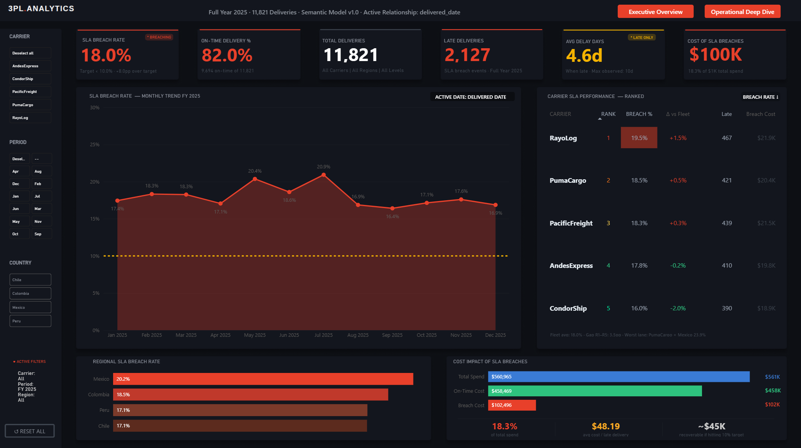
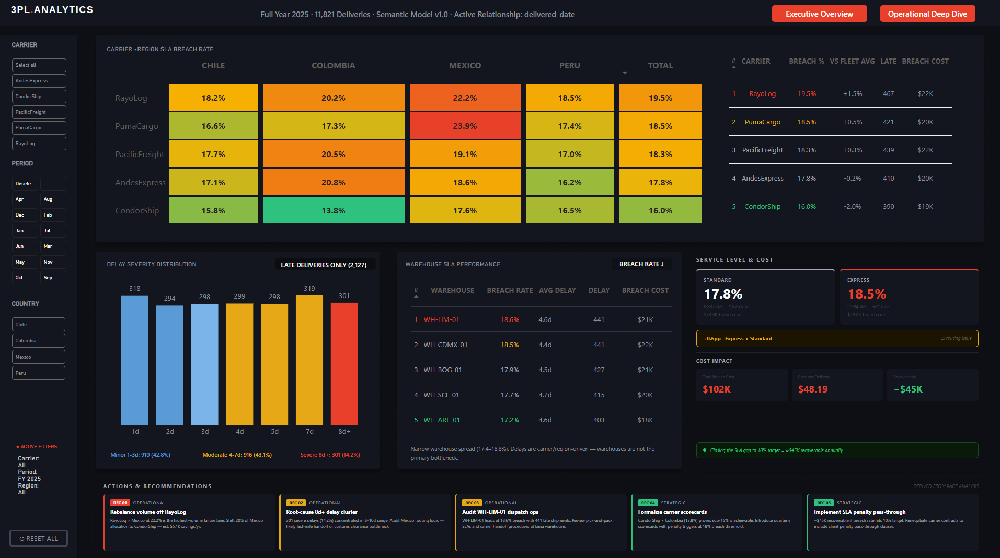

# 3PL Logistics SLA Performance Analytics

**Power BI · DAX · Star Schema · Executive Dashboard**

A production grade BI solution simulating a real world 3PL (Third Party Logistics) analytics implementation. Built to demonstrate executive level analytical thinking: star schema design, a 101-measure DAX library, and a two page dashboard that moves from observation to action.

---

## Dashboard Preview

### Page 1 — Executive Overview


### Page 2 — Operational Deep Dive


---

## Power BI Report

## Power BI Report

> **📊 [View live dashboard](https://app.powerbi.com/groups/1110f86d-c2eb-400b-ab06-ca85a8440c79/reports/f861b637-8707-4b6f-a378-07101aadbcce/3cdd437ee3033e73d700?experience=power-bi)**

---

## Business Problem

A mid-size 3PL operator running warehousing and last-mile distribution across LATAM (Mexico, Colombia, Chile, Peru) is experiencing SLA compliance issues that are eroding client relationships and generating avoidable shipping costs.

**Key questions this dashboard answers:**

1. What is our current SLA breach rate and how far are we from the 10% target?
2. Which carriers and regions are driving the most breaches?
3. What does a breach event actually cost, and how much is recoverable?
4. Is our Express service performing worse than Standard, and why?
5. Which specific carrier × region lanes should operations prioritize?

---

## Key Findings

| Finding | Value |
|---------|-------|
| SLA Breach Rate (FY 2025) | **18.2%** — 8.2pp above the 10% target |
| Total Late Deliveries | **2,187** out of 12,000 |
| Cost of SLA Breaches | **$102.5K** (18.3% of total spend) |
| Worst Carrier | **RayoLog** — 19.7% breach rate |
| Best Carrier | **CondorShip** — 16.3% breach rate |
| Worst Region | **Mexico** — 20.4% breach rate |
| Worst Lane | **PumaCargo × Mexico** — 23.9% |
| Best Lane | **CondorShip × Colombia** — 14.3% |
| Avg Delay (late only) | **4.6 days** |
| Severe Delays (8+ days) | **14.3%** of all late events |
| Express vs Standard Delta | **+0.8pp** — Express underperforms Standard |
| Recoverable at 10% target | **~$45K/year** |

---

## Executive Recommendations

### Operational
- **REC 01 — Rebalance volume off RayoLog.** RayoLog × Mexico (22.2%) is the highest-volume failure lane. Shifting 20% of Mexico allocation to CondorShip would recover an estimated $5.1K/year.
- **REC 02 — Audit Express routing logic.** Express service should outperform Standard; a +0.8pp gap signals a routing or prioritization issue at the lane level, not a capacity problem.
- **REC 03 — Root-cause 8+ day delays.** 312 deliveries breached 8+ days, a 14.3% share that disproportionately drives client escalations and requires dynamic route-failure analysis.

### Strategic
- **REC 01 — Formalize quarterly carrier scorecards.** Institutionalize carrier performance reviews tied to contract SLA thresholds. CondorShip proves sub-15% is achievable; use it as the benchmark.
- **REC 02 — Implement SLA penalty pass through.** With $102.5K in breach costs and a clear $45K recovery opportunity at the 10% target, a contractual cost pass through mechanism creates direct financial incentive for carrier improvement.

---

## Data Model

### Star Schema

```
                    ┌─────────────┐
                    │  dim_date   │
                    │  (365 rows) │
                    └──────┬──────┘
                           │ delivered_date (ACTIVE)
                           │ promised_date  (inactive)
                           │ order_date     (inactive)
                           │ ship_date      (inactive)
              ┌────────────┼────────────┐
              │            │            │
    ┌─────────┴──┐  ┌──────┴──────┐  ┌─┴──────────┐
    │ dim_carrier│  │fact_deliver.│  │ dim_region  │
    │  (5 rows)  │◄─┤ (12,000 r.) ├─►│  (5 rows)  │
    └────────────┘  └──────┬──────┘  └────────────┘
                           │
              ┌────────────┼────────────┐
              │                         │
    ┌─────────┴──┐              ┌───────┴─────┐
    │ dim_client │              │dim_warehouse│
    │  (7 rows)  │              │  (5 rows)   │
    └────────────┘              └─────────────┘
```

### Tables

| Table | Rows | Grain |
|-------|------|-------|
| `fact_deliveries` | 12,000 | 1 row per delivery |
| `dim_date` | 365 | 1 row per calendar day (FY 2025) |
| `dim_carrier` | 5 | 1 row per carrier |
| `dim_client` | 7 | 1 row per client |
| `dim_region` | 5 | 1 row per destination region |
| `dim_warehouse` | 5 | 1 row per origin warehouse |

### Date Strategy

The active relationship is on `delivered_date` , this is an operational SLA dashboard; the primary analytical question is "what delivered in this period, and how did it perform?" Role playing inactive relationships for `promised_date`, `order_date`, and `ship_date` are activated via `USERELATIONSHIP()` where needed (e.g., SLA Breach Rate by Promised Date for backlog analysis).

### Key fact_deliveries Columns

| Column | Type | Description |
|--------|------|-------------|
| `delivery_id` | Integer | Surrogate key |
| `order_date` | Date | When the order was placed |
| `ship_date` | Date | When the order left the warehouse |
| `promised_date` | Date | SLA commitment date |
| `delivered_date` | Date | Actual delivery date |
| `is_late` | 0/1 | 1 if delivered_date > promised_date |
| `delay_days` | Integer | Days beyond promised_date (0 if on-time) |
| `service_level` | String | "Express" or "Standard" |
| `shipping_cost_usd` | Float | Cost per delivery in USD |

---

## KPI Definitions

| KPI | Business Definition | DAX Pattern |
|-----|---------------------|-------------|
| **SLA Breach Rate** | % of deliveries where actual delivery date exceeded the promised date. Target: < 10%. | `DIVIDE([Late Deliveries], [Total Deliveries])` |
| **On-Time Delivery %** | Complement of SLA Breach Rate. Target: > 90%. | `1 - [SLA Breach Rate]` |
| **Late Deliveries** | Count of deliveries with `is_late = 1` (delay_days > 0). | `SUM(fact_deliveries[is_late])` with TREATAS |
| **Avg Delay Days** | Mean delay among late only deliveries. Excludes on-time to avoid signal dilution. | `AVERAGEX(FILTER(...delay_days > 0), delay_days)` |
| **Cost of SLA Breaches** | Total shipping cost attributed to breach events. Proxy for financial exposure. | `CALCULATE(SUM(cost), is_late = 1)` |
| **Express vs Standard Delta** | Breach rate gap between service levels. Positive = Express underperforms. | `[Express SLA Breach Rate] - [Standard SLA Breach Rate]` |
| **Recoverable Cost** | Estimated savings if breach rate were reduced to the 10% target. | Formula in DAX file |

---

## DAX Measure Library

101 measures organized across 7 display folders:

| Folder | Measures | Purpose |
|--------|----------|---------|
| `0. Filters & Context` | 8 | Period slicer logic, (Period) KPIs |
| `1. Core KPIs` | 8 | SLA Breach Rate, OTD%, Late Deliveries, etc. |
| `2. Cost` | 11 | Breach cost, CPD, recoverable savings |
| `3. Time Intelligence` | 10 | MoM Δ, YTD, Rolling 3M, role-playing dates |
| `4. Rankings` | 13 | RANKX carrier/warehouse/region, gap analysis |
| `5. Service Level` | 13 | Express/Standard split, delay severity bands |
| `6. KPI Cards & Formatting` | 37 | HTML visuals, conditional colors, labels |

→ See [`dax/all_measures.dax`](dax/all_measures.dax) for all definitions with inline comments.

---

## Dashboard Design

### Design System

| Token | Value |
|-------|-------|
| Page background | `#0D0F14` |
| Card background | `#13161E` |
| Positive / green | `#2EC27E` |
| Negative / red | `#E8402A` |
| Warning / amber | `#E6A817` |
| Font | Segoe UI |
| Canvas | 1920 × 1080 |

### Page 1 — Executive Overview

Story: *How are we performing, where are we losing, and what does it cost?*

- 6 KPI cards (SLA Breach Rate, OTD%, Total Deliveries, Late Deliveries, Avg Delay Days, Cost of SLA Breaches)
- SLA Breach Rate monthly trend line with 10% target reference line
- Carrier SLA Performance ranked table
- Regional SLA bar chart
- Cost impact breakdown (Total Spend / On-Time / Breach)

### Page 2 — Operational Deep Dive

Story: *WHERE are failures concentrated → HOW BAD are they → WHAT do we do?*

**Act 1 (WHERE):** Carrier × Region heatmap with color-scaled breach rates, carrier summary columns (Total, Late, Avg Delay, Breach Cost), KEY FINDING callout, and 5 recommendations (3 operational, 2 strategic).

**Act 2 (HOW BAD):** Delay Severity Distribution histogram (1d through 10d+), Warehouse SLA Performance table with ranked breach rates.

**Act 3 (SO WHAT):** Service Level & Cost HTML panel (Standard vs Express comparison, Cost Impact section with total breach cost, CPD, and recoverable amount).

---

## Technical Architecture

```
CSV Source Files (6 tables)
        ↓
Power Query (M) — type casting, column rename, calculated columns
        ↓
Tabular Semantic Model (Compatibility Level 1600)
  ├── Star schema — 8 relationships, all single-direction
  ├── dim_date — dataCategory: Time, 14 calculated columns
  ├── dim_period — DATATABLE() for period slicer (Q/Annual)
  └── _Measures table — 101 DAX measures, 7 display folders
        ↓
Power BI Report Layer
  ├── Page 1 — Executive Overview (1920×1080)
  └── Page 2 — Operational Deep Dive (1920×1080)
       ├── Matrix visual (heatmap)
       ├── Column chart (delay severity)
       ├── Table visual (warehouse SLA)
       └── HTML Content visual (service level & cost)
```

**Design decisions worth noting:**

- `TREATAS` used in core KPI measures to force `delivered_date` context independent of which date column drives the visual axis avoids BLANK rows in time series.
- HTML Content visual used for the Service Level & Cost panel to achieve layout density and conditional formatting not achievable with native visuals.
- `dim_period` as a disconnected table (no relationship to fact)  drives period measures via `SELECTEDVALUE()` pattern, avoids cross-filter contamination.
- `country_upper` calculated column in `dim_region` using `UPPER()`  ensures consistent casing in matrix column headers regardless of source data.
- `RANKX` with `DENSE` prevents rank gaps on ties; `HASONEVALUE` guard suppresses total row rank.

---

## Dataset

Synthetic dataset, 12,000 deliveries, FY 2025 (Jan–Dec), generated with realistic late_bias parameters per carrier and region.

| File | Rows | Description |
|------|------|-------------|
| [`data/fact_deliveries.csv`](data/fact_deliveries.csv) | 12,000 | Delivery grain fact table |
| [`data/dim_date.csv`](data/dim_date.csv) | 365 | Calendar dimension |
| [`data/dim_carrier.csv`](data/dim_carrier.csv) | 5 | Carrier dimension |
| [`data/dim_client.csv`](data/dim_client.csv) | 7 | Client dimension |
| [`data/dim_region.csv`](data/dim_region.csv) | 5 | Region/country dimension |
| [`data/dim_warehouse.csv`](data/dim_warehouse.csv) | 5 | Warehouse dimension |

---

## Tools & Stack

| Tool | Version | Purpose |
|------|---------|---------|
| Power BI Desktop | March 2026 | Report authoring |
| DAX | — | Semantic model calculations |
| Power Query (M) | — | Data transformation |
| Figma | March 2026 | Dashboard background design |
| Python | 3.14 | Dataset generation |

---

## Author

Built as a portfolio project to demonstrate senior BI analyst capabilities: data modeling, DAX development, executive dashboard design, and business storytelling.

**Focus areas demonstrated:** Star schema design · Role playing date dimensions · TREATAS pattern · RANKX · HTML Content visuals · Conditional formatting via DAX · Executive narrative structure
